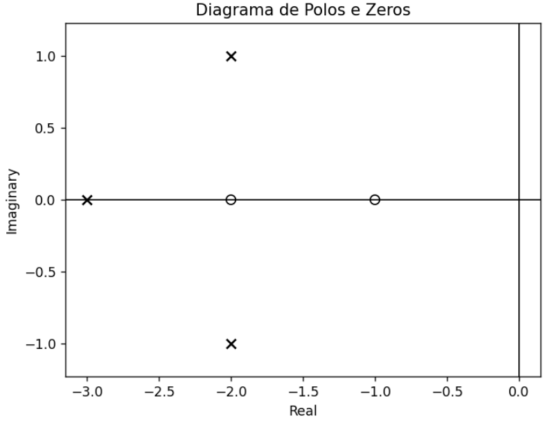
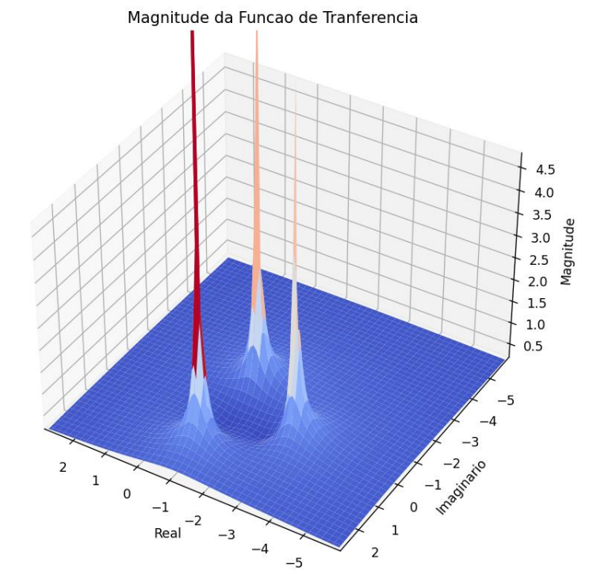

Este código foi desenvolvido para os estudos de polos e zeros de um sistema para a matéria de Sinais e sistemas do curso de engenheria eletronica.
Ele cria uma gráfico de polos e zeros dado uma função de transferência, são gerados um gráfico 2D onde mostra os polos e zeros, um em 3D que mostra a magnitude, e o outro mostrando o corte do anterior no eixo real igual a zero.

A seguinte função de transferência foi usada como exemplo: $𝐻(𝑠)=((𝑠+1)∗(𝑠+2))/((2+2𝑠+3)∗(𝑠+3))$ 
Gerando os seguinte gráficos:

